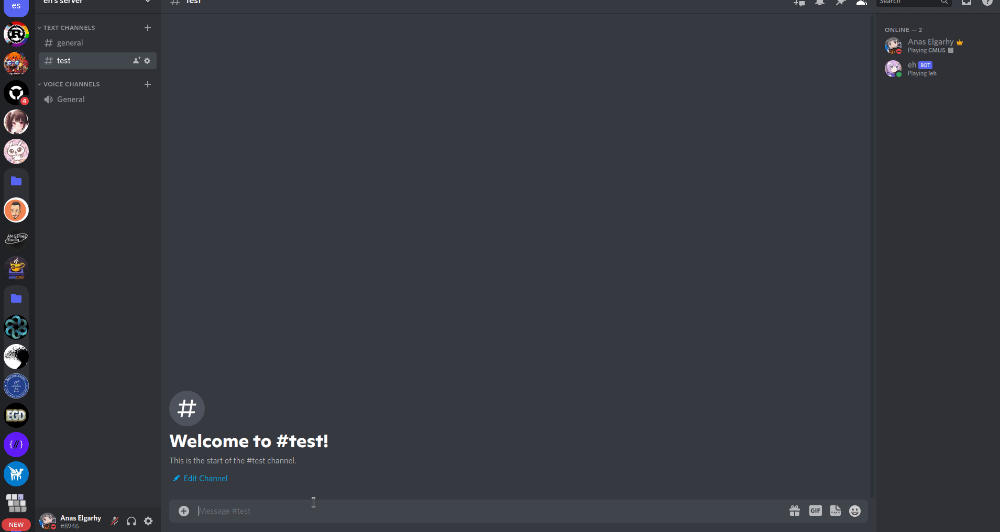

# Simple discord bot for programming memes.

## Features
- Fetch memes from pinterest.

## Commands
|  Command   |           Description           |
|:----------:|:-------------------------------:|
|   `!eh`    |       Get a random meme.        |
| `!eh_dev`  | Get a info about the developer. |
| `!eh_src`  | Get a link to the source code.  |
| `!eh_help` |     Get a list of commands.     |

## Requirements
- python 3.6+
- discord.py
- py3-pinterest

## Todo
- [ ] Get memes from reddit.
- [ ] Get memes from imgur.
- [ ] Update memes list every day.

